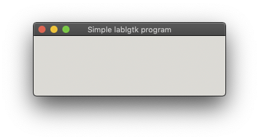

lablgtk_quickstart [](https://travis-ci.org/mamewotoko/lablgtk_quickstart)
==================



Build
-------

### MacOS

1. install [opam](https://opam.ocaml.org/doc/Install.html)
2. install gtk

    ```bash
    brew install gtk
    ```
    
3. install opam packages

    ```bash
    sh setup-opam
    ```

4. make

    ```
    make
    ```

### Vagrant (ubuntu 16.04)

1. install [vagrant](https://www.vagrantup.com/downloads.html)
2. start vagrant box

    ```bash
    vagrant up
    ```

3. ssh login to vagrant box

    ```bash
    vagrant ssh
    ```

4. install opam packages

    ```bash
    sh setup-opam
    ```

4. make

    ```
    make
    ```

### Option: build with dune 

1. install dune

    ```
    opam install dune
    ```

2. build app

    ```
    dune build main.exe
    ```

Run
----

```
./gtk_app
```

Option: run with dune
---------------------

```
dune run main.exe
```

References
----------

* [http://lablgtk.forge.ocamlcore.org/](http://lablgtk.forge.ocamlcore.org/)
* [Introduction to Gtk](https://ocaml.org/learn/tutorials/introduction_to_gtk.html)
* [mmottl/ocaml-makefile](https://github.com/mmottl/ocaml-makefile)

----
Takashi Masuyama < mamewotoko@gmail.com >  
https://mamewo.ddo.jp/
